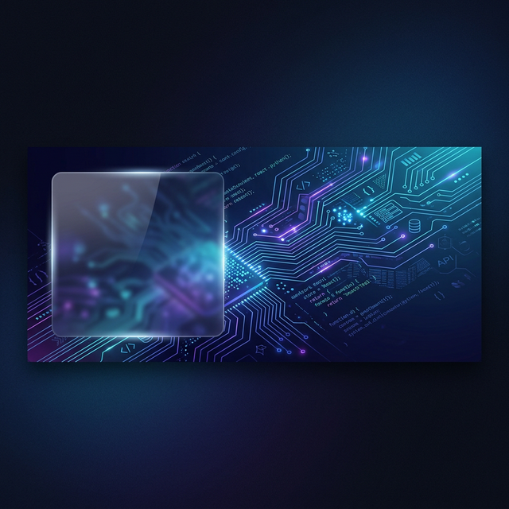

# 
✨ Senior Full Stack Developer ✨

  

  
  

---

## 👨‍💻 About Me

I am a **Senior Full Stack Developer** with **3+ years of professional experience** in architecting scalable digital ecosystems. Currently, I lead a high-performing team of **12–15 developers at SoftSensor.ai**, where we engineer enterprise-grade solutions like Vehicle Management Systems and advanced AI agents.

I bridge the gap between complex backend logic and high-fidelity, interactive user experiences. My expertise spans across **Full Stack Web/Mobile Development**, **AI/ML Integration**, and **System Architecture**.

- 🔭 **Expertise:** Leading engineering teams, architecting distributed Node.js systems, and building AI-driven automation.
- ⚡ **Tech Stack Focus:** React/Next.js, Node.js, Python/FastAPI, and AWS Infrastructure.
- 🌱 **Innovation:** Deeply passionate about **Speech Emotion Recognition (ML)** and **3D-integrated Mobile Applications**.
- 💬 **Ask me about:** Team leadership at scale, AI Agent Orchestration, or high-performance frontend architectures.

---

## 🚀 Core Expertise

### 🌐 Frontend & Mobile

  
  
  
  
  

### ⚙️ Backend & Infrastructure

  
  
  
  
  

### 🤖 AI, ML & Tooling

  
  
  
  

---

## 🌟 Featured Projects

| Project                                                                | Description                                                 | Stack                  |
| :--------------------------------------------------------------------- | :---------------------------------------------------------- | :--------------------- |
| **[Speech Emotion Recognition](https://anubhab-guha.vercel.app/)**     | Real-time ML model for voice-based emotion analysis.        | Python, Librosa, CNN   |
| **[Divya Darshan](https://anubhab-guha.vercel.app/)**                  | High-fidelity 3D integrated mobile application.             | React Native, Three.js |
| **[Forge Developers](https://forge-developers.vercel.app/)**           | Professional SaaS for API testing & developer productivity. | Next.js, Prisma, PG    |
| **[AI PR Generator](https://github.com/anubhabguha1999/pr-generator)** | Scalable worker-based pull request automation pipeline.     | Node, Redis, BullMQ    |

---

## 📊 Performance & Impact

  
  

  

---

## 🤝 Let's Connect

  
  
  

  <i>"Architecture is the art of balancing complexity with clarity."</i>

